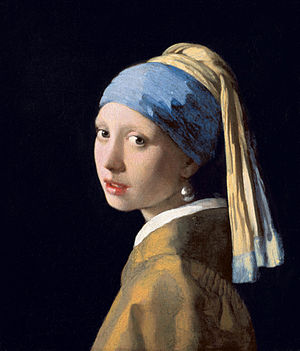

## NN painting
Mimic an image using a fully-connected neural network. The input to the network are the coordinate of pixels of the image i.e. (x, y) and the ground true label is the corresponding RGB of that pixel.

Basically it's a regression task in which our neural network tries to learn the mapping between coordinate and RGB value of a specified image. We use the [Square Loss](https://en.wikipedia.org/wiki/Mean_squared_error) to make blurry effect.

### Example  

- Input image   

   

- training process

   

### How to run

```bash
# in the root directory
pip install -r requirements.txt
pip install -r examples/nn_paint/requirements.txt

# run
python examples/nn_paint/run.py --img your-img-file 
```
